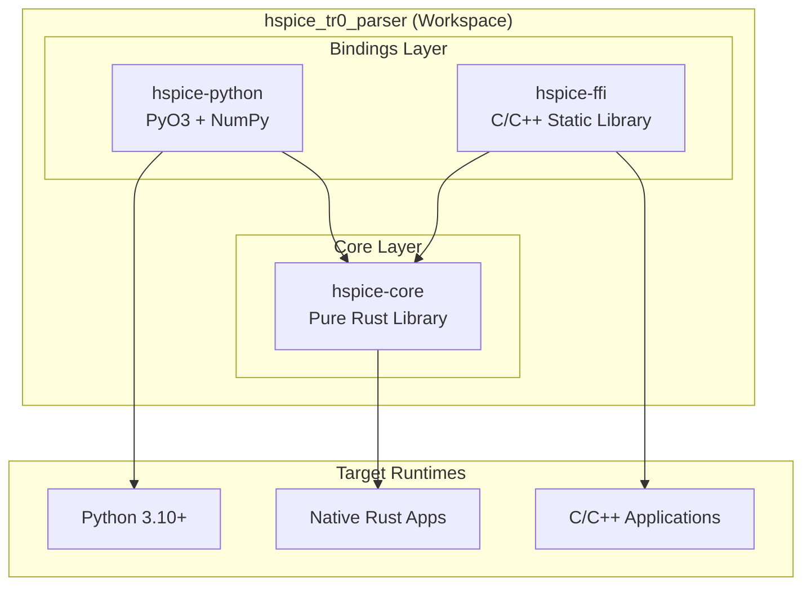
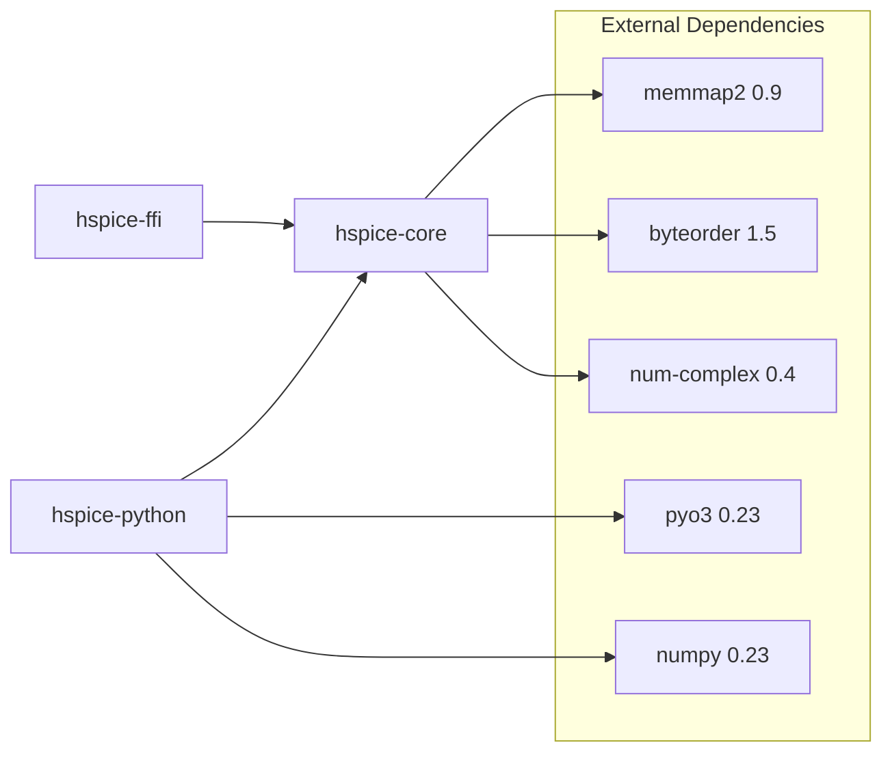

# hspice_tr0_parser Architecture

## 1. Architecture Overview



## 2. Why Three Crates?

### 2.1 Core Problems

| Problem          | Single Crate Approach                      | Three Crate Approach                              |
| ---------------- | ------------------------------------------ | ------------------------------------------------- |
| Dependency Bloat | PyO3/FFI forced on all users               | On-demand inclusion, zero binding deps for core   |
| Compile Time     | Full rebuild even for binding-only changes | Incremental builds, bindings don't recompile core |
| Binary Size      | Includes all binding code redundantly      | Each target only includes necessary code          |
| Test Isolation   | Binding tests mixed with core tests        | Independent testing per layer                     |

### 2.2 Design Principles

```yaml
principle: "Write Once, Bind Twice"
rationale: |
  Core parsing logic is implemented once, then adapted to multiple runtimes
  through different binding layers. This is interface adaptation, not code duplication.

constraints:
  - hspice-core must not depend on any binding frameworks (PyO3, wasm-bindgen)
  - Binding layers only handle data conversion, no business logic
  - New features are added to hspice-core only; binding layers benefit automatically
```

## 3. Crate Details

### 3.1 hspice-core (Core Library)

```toml
# Role: Pure Rust library, single source of truth for all algorithms
[dependencies]
byteorder = "1.5"      # Byte order handling
memmap2 = "0.9"        # Memory-mapped I/O
num-complex = "0.4"    # Complex number operations
```

**Responsibilities:**

- ✅ HSPICE binary file parsing
- ✅ Memory-mapped file reading
- ✅ Streaming for large files
- ✅ SPICE3 raw format conversion
- ❌ Any runtime-specific data type conversions

**Module Structure:**

```
hspice-core/src/
├── lib.rs        # Public API
├── types.rs      # Type definitions
├── reader.rs     # I/O layer
├── parser.rs     # Parsing layer
├── stream.rs     # Streaming reader
└── writer.rs     # Format conversion
```

### 3.2 hspice-python (Python Bindings)

```toml
# Role: Bridge between Python and Rust worlds
[lib]
crate-type = ["cdylib"]  # Compiles to .so/.pyd

[dependencies]
hspice-core = { path = "../hspice-core" }
pyo3 = { features = ["extension-module", "abi3-py310"] }
numpy = "0.23"
```

**Responsibilities:**

- ✅ `Rust Vec<f64>` ↔ `NumPy ndarray`
- ✅ `Rust Result<T>` → `Python Exception`
- ✅ Provide Pythonic API conventions
- ❌ Implement any parsing logic

### 3.3 hspice-ffi (C Bindings)

```toml
# Role: C/C++ language bindings
[lib]
crate-type = ["staticlib", "cdylib"]

[dependencies]
hspice-core = { path = "../hspice-core" }
```

**Responsibilities:**

- ✅ Opaque handles (CHspiceResult)
- ✅ C-style error handling (NULL returns)
- ✅ Memory-safe wrappers
- ❌ Implement any parsing logic

## 4. Dependency Graph



## 5. Build Artifacts

| Crate           | Artifact Type | File Format    | Use Case          |
| --------------- | ------------- | -------------- | ----------------- |
| `hspice-core`   | `rlib`        | `.rlib`        | Rust dependencies |
| `hspice-python` | `cdylib`      | `.so` / `.pyd` | Python import     |
| `hspice-ffi`    | `staticlib`   | `.a`           | C/C++ linking     |

## 6. Directory Structure

```
hspice_tr0_parser/
├── Cargo.toml              # Workspace definition
├── crates/
│   ├── hspice-core/       # Core library
│   │   ├── Cargo.toml     # No binding dependencies
│   │   └── src/
│   ├── hspice-python/     # Python bindings
│   │   ├── Cargo.toml     # depends on hspice-core + pyo3
│   │   └── src/
│   └── hspice-ffi/        # C FFI
│       ├── Cargo.toml     # depends on hspice-core
│       └── src/
├── pyproject.toml          # maturin configuration
├── hspice_tr0_parser.py    # Python wrapper
├── include/                # C header files
├── tests/                  # Python tests
└── example/                # Example files
```

## 7. FAQ

### Q: How do I use only the Rust API?

**A:**

```toml
[dependencies]
hspice-core = { git = "https://github.com/HaiwenZhang/hspice_tr0_parser" }
```

---

_Document Version: 2.0.0 | Last Updated: 2025-12-13_
