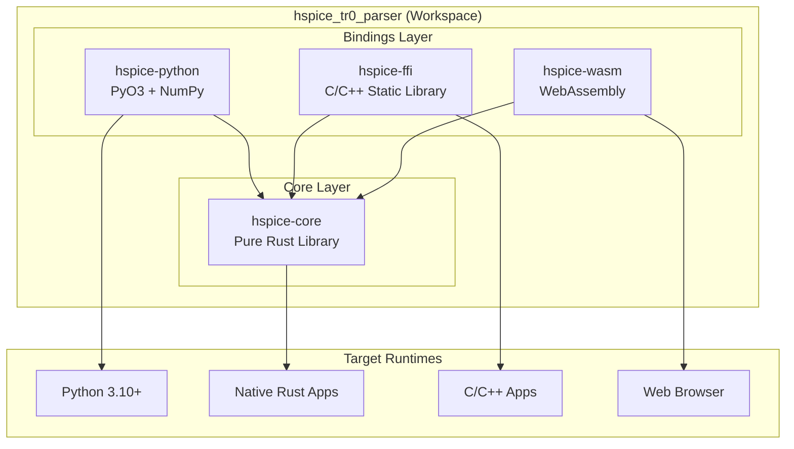
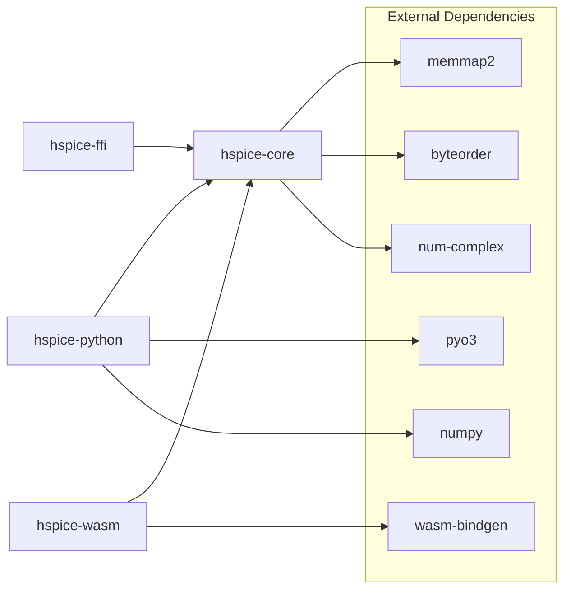

# hspice_tr0_parser Architecture

## 1. Overview



## 2. Why Four Crates?

| Problem          | Single Crate                | Multi-Crate                              |
| ---------------- | --------------------------- | ---------------------------------------- |
| Dependency Bloat | PyO3/FFI/WASM forced on all | On-demand, zero deps for core            |
| Compile Time     | Full rebuild always         | Incremental, bindings don't rebuild core |
| Binary Size      | All binding code included   | Each target only necessary code          |
| Test Isolation   | Tests mixed                 | Independent per layer                    |

## 3. Crate Details

### 3.1 hspice-core

```toml
[dependencies]
byteorder = "1.5"
memmap2 = "0.9"
num-complex = "0.4"
anyhow = "1.0"
```

**Core data structure:**

```rust
pub struct WaveformResult {
    pub title: String,
    pub date: String,
    pub analysis: AnalysisType,
    pub variables: Vec<Variable>,
    pub sweep_param: Option<String>,
    pub tables: Vec<DataTable>,
}
```

### 3.2 hspice-python

```toml
[dependencies]
hspice-core = { path = "../hspice-core" }
pyo3 = { features = ["extension-module", "abi3-py310"] }
numpy = "0.23"
```

Exposes: `read()`, `convert_to_raw()`, `stream()`

### 3.3 hspice-ffi

```toml
[lib]
crate-type = ["staticlib", "cdylib"]

[dependencies]
hspice-core = { path = "../hspice-core" }
```

Exposes: `waveform_read()`, `waveform_free()`, `waveform_get_*()` functions

### 3.4 hspice-wasm

```toml
[dependencies]
hspice-core = { path = "../hspice-core" }
wasm-bindgen = "0.2"
js-sys = "0.3"
```

Exposes: `parseHspice()`, `getSignalNames()`, `getSignalData()`

## 4. Dependency Graph



## 5. Build Artifacts

| Crate           | Type        | Format         | Use Case      |
| --------------- | ----------- | -------------- | ------------- |
| `hspice-core`   | `rlib`      | `.rlib`        | Rust deps     |
| `hspice-python` | `cdylib`    | `.so` / `.pyd` | Python import |
| `hspice-ffi`    | `staticlib` | `.a`           | C/C++ linking |
| `hspice-wasm`   | `cdylib`    | `.wasm`        | Browser       |

## 6. Directory Structure

```
hspice_tr0_parser/
├── Cargo.toml               # Workspace
├── pyproject.toml           # Python config
├── hspice_tr0_parser.py     # Python wrapper
├── crates/
│   ├── hspice-core/
│   ├── hspice-python/
│   ├── hspice-ffi/
│   └── hspice-wasm/
│       ├── package.json     # npm config
│       └── hspice_wasm.d.ts # TypeScript types
├── include/                  # C headers
├── docs/
│   ├── ARCHITECTURE.md
│   └── api/
├── tests/                    # Python tests
└── example/
```

---

_Document Version: 3.0.0 | Last Updated: 2025-12-13_
