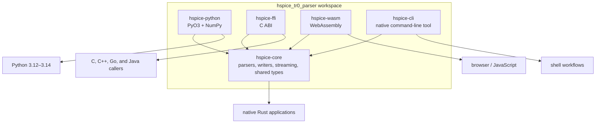
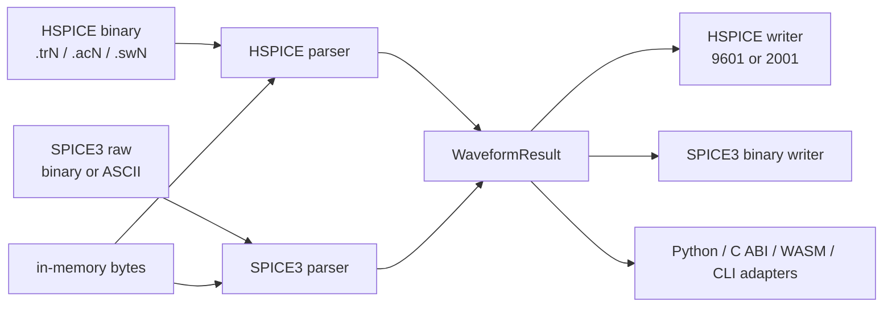

# hspice_tr0_parser Architecture

## 1. Overview


```mermaid
graph TB
    subgraph Workspace["hspice_tr0_parser workspace"]
        Core["hspice-core<br/>parsers, writers, streaming, shared types"]
        Python["hspice-python<br/>PyO3 + NumPy"]
        FFI["hspice-ffi<br/>C ABI"]
        WASM["hspice-wasm<br/>WebAssembly"]
        CLI["hspice-cli<br/>native command-line tool"]

        Python --> Core
        FFI --> Core
        WASM --> Core
        CLI --> Core
    end

    Python --> PyRuntime["Python 3.12–3.14"]
    FFI --> NativeApps["C, C++, Go, and Java callers"]
    WASM --> Browser["browser / JavaScript"]
    CLI --> Shell["shell workflows"]
    Core --> RustApps["native Rust applications"]
```

The workspace contains five crates. `hspice-core` owns the format-neutral data
model and all file-format logic; the other crates adapt that API to a specific
runtime or interface.

## 2. Crate Responsibilities

| Crate | Responsibility | Main public surface |
| ----- | -------------- | ------------------- |
| `hspice-core` | HSPICE and SPICE3 parsing/writing, streaming, shared types | `read`, `read_raw`, `read_bytes`, `read_raw_bytes`, `write_hspice`, `write_spice3_raw`, streaming functions |
| `hspice-python` | Python objects and NumPy conversion | `read`, `read_raw`, `convert_to_raw`, `convert_raw_to_hspice`, `stream`, `init_logging` |
| `hspice-ffi` | Stable C ABI used directly or through other native languages | `waveform_read`, `waveform_read_raw`, `waveform_get_*`, `waveform_stream_*` |
| `hspice-wasm` | In-memory browser parsing and JavaScript object conversion | `parseHspice`, `parseRaw`, `getSignalNames`, `getSignalData` |
| `hspice-cli` | Standalone inspection, conversion, streaming, scan, and CSV export | `info`, `read`, `read-raw`, `convert`, `stream`, `scan`, `export` |

See [CLI.md](CLI.md) for command syntax and output behavior.

Keeping runtime-specific dependencies out of `hspice-core` lets native Rust
users avoid PyO3, C ABI, WASM, and CLI dependencies.

## 3. Core Data Flow


```mermaid
flowchart LR
    HspiceFile["HSPICE binary<br/>.trN / .acN / .swN"] --> HspiceParser["HSPICE parser"]
    RawFile["SPICE3 raw<br/>binary or ASCII"] --> RawParser["SPICE3 parser"]
    Bytes["in-memory bytes"] --> HspiceParser
    Bytes --> RawParser

    HspiceParser --> Result["WaveformResult"]
    RawParser --> Result

    Result --> HspiceWriter["HSPICE writer<br/>9601 or 2001"]
    Result --> RawWriter["SPICE3 binary writer"]
    Result --> Bindings["Python / C ABI / WASM / CLI adapters"]
```

`WaveformResult` is the interchange type:

```rust
pub struct WaveformResult {
    pub title: String,
    pub date: String,
    pub analysis: AnalysisType,
    pub variables: Vec<Variable>,
    pub sweep_param: Option<String>,
    pub tables: Vec<DataTable>,
}
```

The HSPICE writer supports transient, AC, and DC data. The output extension
selects and validates the analysis (`.trN`, `.acN`, or `.swN`), while
`PostVersion::V9601` and `PostVersion::V2001` select `f32` and `f64` storage.
At present, HSPICE writing is exposed by the Rust, Python, and CLI interfaces;
the C ABI and WASM interfaces remain read-only.

## 4. Core Modules

| Module | Purpose |
| ------ | ------- |
| `parser` | Parse HSPICE headers and complete in-memory waveforms |
| `block_reader` | Validate and iterate HSPICE framed records |
| `data_builder` | Decode interleaved scalar/complex values into column vectors |
| `stream` | Memory-bounded HSPICE iteration over mapped input |
| `raw_parser` | Parse binary and ASCII SPICE3 raw files |
| `hspice_writer` | Validate and write little-endian HSPICE 9601/2001 records |
| `writer` | Write SPICE3 binary raw files and implement HSPICE-to-raw conversion |
| `types` | Public result, variable, analysis, precision, and error types |

The main core dependencies are `byteorder`, `memmap2`, `num-complex`,
`thiserror`, and `tracing`. Runtime crates add their own adapter dependencies,
such as PyO3/NumPy, `wasm-bindgen`, or `clap`.

## 5. Build Artifacts

| Crate | Artifact | Typical use |
| ----- | -------- | ----------- |
| `hspice-core` | Rust `rlib` | Rust dependency |
| `hspice-python` | Python extension (`.so`, `.dylib`, or `.pyd`) | `import hspicetr0parser` |
| `hspice-ffi` | Static and dynamic library (`.a`, `.so`, `.dylib`, or `.dll`) | C ABI / CGO / JNA |
| `hspice-wasm` | `.wasm` plus generated JavaScript/TypeScript bindings | Browser applications |
| `hspice-cli` | `hspice-cli` executable | Shell and automation |

## 6. Repository Layout

```text
hspice_tr0_parser/
├── Cargo.toml
├── pyproject.toml
├── hspice_tr0_parser.py        # Compatibility Python wrapper
├── crates/
│   ├── hspice-core/
│   ├── hspice-python/
│   ├── hspice-ffi/
│   ├── hspice-wasm/
│   └── hspice-cli/
├── include/                    # Public C header
├── java/                       # Java/JNA wrapper
├── docs/
├── tests/                      # Python integration tests
└── example/                    # HSPICE fixtures and reference data
```

---

_Workspace version: 1.5.0 | Last updated: 2026-08-01_
