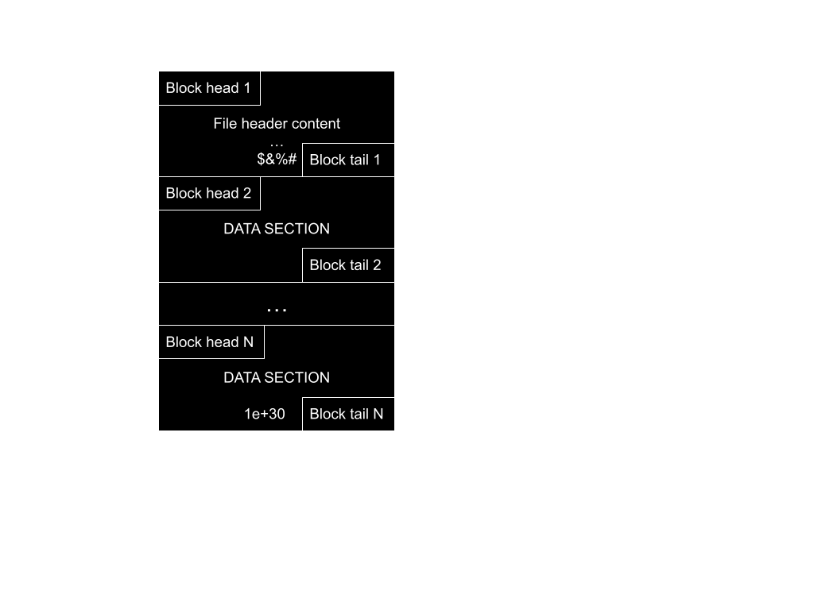
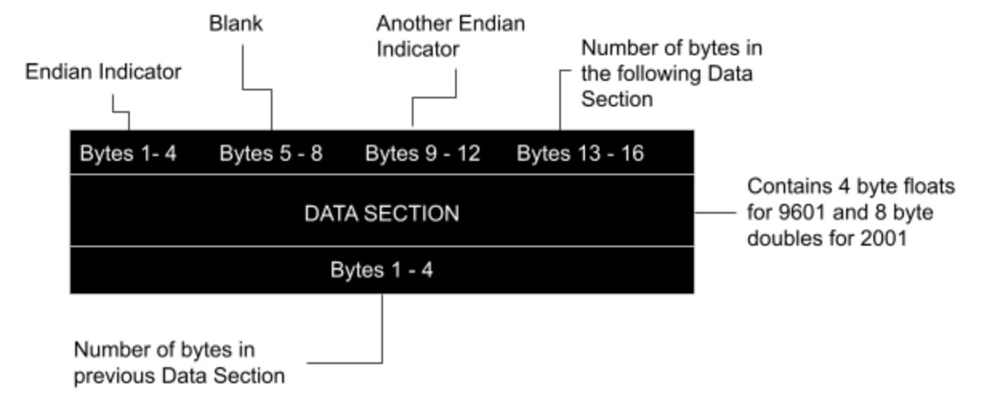

# HSPICE Binary Waveform Format (TR0/AC0/SW0)

This document describes the binary format used by HSPICE for transient
(`.trN`), AC (`.acN`), and DC sweep (`.swN`) results. The most common first-run
extensions are `.tr0`, `.ac0`, and `.sw0`.

## Overview

HSPICE is a circuit simulator that produces output files containing voltage and current values from simulated circuits. When using `.option post=1`, HSPICE generates binary output files. The format version can be specified with `.option post_version=9601` or `.option post_version=2001`.

### Supported Analysis Types

| Extension           | Analysis Type      | Value layout |
| ------------------- | ------------------ | ------------ |
| `.tr0`, `.tr1`, ... | Transient Analysis | Real         |
| `.ac0`, `.ac1`, ... | AC Analysis        | Complex signals |
| `.sw0`, `.sw1`, ... | DC Sweep Analysis  | Real         |

The scalar width follows the POST version described below.

### Format Versions

| Version | Description     | Data Width    |
| ------- | --------------- | ------------- |
| `9007`  | Legacy format   | 4-byte float  |
| `9601`  | Standard format | 4-byte float  |
| `2001`  | Extended format | 8-byte double |

### Writing Compatible Files

The Rust core writes this record format with `write_hspice`, and the CLI can
convert a SPICE3/ngspice raw file directly:

```bash
hspice-cli convert simulation.raw simulation.tr0
hspice-cli convert simulation.raw simulation.tr0 --post-version 2001
```

Generated records are little-endian, use an 8192-byte maximum payload, and
include the precision-specific end marker. The output extension must match the
analysis (`.trN` transient, `.acN` AC, `.swN` DC). `PostVersion::V9601`
downcasts values to `f32`; `PostVersion::V2001` stores `f64` values.

The writer accepts transient, AC, and DC `WaveformResult` values. It rejects
operating-point, noise, and unknown analyses; empty or inconsistent tables;
non-finite or unrepresentable values; non-ASCII names or names containing
whitespace; and non-AC complex values with a non-zero imaginary component.
Multiple tables require a sweep parameter and a sweep value for every table.

Compatibility tests round-trip the 9601 TR0, 2001 TR0, 9601 AC0, and 9601 SW0
fixtures through SPICE3 raw and reproduce every original HSPICE file byte for
byte. Unit tests also cover generated AC complex data and multi-table sweeps.

## File Structure

The binary file consists of ordered blocks: a **header block** followed by multiple **data blocks**.


<sub>Figure 1: Overall binary file structure</sub>

```
┌─────────────────────────────────────────────────────┐
│                  Header Block                        │
│  (text metadata, terminated by $&%# marker)         │
├─────────────────────────────────────────────────────┤
│                  Data Block 1                        │
├─────────────────────────────────────────────────────┤
│                  Data Block 2                        │
├─────────────────────────────────────────────────────┤
│                      ...                             │
├─────────────────────────────────────────────────────┤
│         Data Block N (ends with >9e29 marker)       │
└─────────────────────────────────────────────────────┘
```

## Block Structure

Each block consists of a 16-byte **block header**, a variable-length **data
section**, and a 4-byte **block trailer**.


<sub>Figure 2: Generic block structure</sub>

```
┌──────────────────────────────────────────────────────────────────────┐
│                         Block Header (16 bytes)                       │
├────────────────┬────────────────┬────────────────┬───────────────────┤
│  Endian Check  │  Item Count    │  Endian Check  │  Data Size (N)    │
│  0x00000004    │  (4 bytes)     │  0x00000004    │  (4 bytes)        │
│  (4 bytes)     │   (4 bytes)    │  (4 bytes)     │                   │
├────────────────┴────────────────┴────────────────┴───────────────────┤
│                         Data Section (N bytes)                        │
│                      (Header text or float data)                      │
├──────────────────────────────────────────────────────────────────────┤
│                        Block Tail (4 bytes)                           │
│                    (Same value as Data Size N)                        │
└──────────────────────────────────────────────────────────────────────┘
```

### Block Header Details

| Offset | Size (bytes) | Description                                                  |
| ------ | ------------ | ------------------------------------------------------------ |
| 0      | 4            | Endianness marker (`0x00000004` for LE, `0x04000000` for BE) |
| 4      | 4            | Number of payload items (not required by the current reader) |
| 8      | 4            | Endianness marker (same as offset 0)                         |
| 12     | 4            | Number of data bytes in this block                           |

### Endianness Detection

The file's endianness is detected from the first block header:

```c
// C-style detection logic:
if (blockHeader[0] == 0x00000004 && blockHeader[2] == 0x00000004) {
    // Little-endian: no byte swap needed
    swap = 0;
} else if (blockHeader[0] == 0x04000000 && blockHeader[2] == 0x04000000) {
    // Big-endian: byte swap required
    swap = 1;
}
```

## Header Block

The header block is unique because its data section contains fixed-width,
ASCII-compatible text instead of waveform values. This metadata describes the
simulation and signal names.

### Header String Structure

The header string consists of several concatenated substrings (no newline characters):

```
┌──────────────────────────────────────────────────────────────────────────┐
│  Number String (20/24 chars)  │  *  │  Simulation Info  │  Signal Names  │
└──────────────────────────────────────────────────────────────────────────┘
```

### Header Field Positions

| Position (bytes) | Length | Content                                  |
| ---------------- | ------ | ---------------------------------------- |
| 0-3              | 4      | Number of variables (including scale)    |
| 4-7              | 4      | Number of probes                         |
| 8-11             | 4      | Number of sweeps (0 or 1)                |
| 16-19            | 4      | Post format identifier 1 (`9007`/`9601`) |
| 20-23            | 4      | Post format identifier 2 (`2001`)        |
| 24-87            | 64     | Simulation title / source filename       |
| 88-111           | 24     | Date and time string                     |
| 176-185          | 10     | Sweep size (format 9601)                 |
| 187-196          | 10     | Sweep size (format 2001)                 |
| 256+             | varies | Vector descriptions                      |

### Example Header

```
  00050000000100009601    * exampleFile.sp
  06/08/2020      14:04:30 Copyright (c) 1986 - 2020 by Synopsys, Inc. All Rights Reserved.
  10
  1       1       1       1       8
  TIME            v(0             v(vo            v(vs            i(vs            r1
  $&%#
```

<sub>Figure 3: Example header block content (line breaks added for readability, not present in actual file)</sub>

### Vector Description Section

Starting at byte 256, the vector description section contains:

```
<var_type> <internal_names...> <scale_name> <signal_names...> $&%#
```

Where:

- `var_type`: Variable type indicator
  - `1` = Time domain (real values)
  - `2` = Frequency domain (complex values)
- `internal_names`: Internal variable identifiers (same count as variables)
- `scale_name`: Independent variable name (e.g., "TIME", "HERTZ")
- `signal_names`: Signal descriptors exactly as stored (e.g., `v(out`, `i(vdd`;
  HSPICE omits the closing parenthesis)
- `$&%#`: End-of-header marker

## Data Blocks

All blocks after the header contain simulation data. The data section stores floating-point values.

### Data Format by Version

| Version | Data Type | Bytes per Value | Example End Marker       |
| ------- | --------- | --------------- | ------------------------ |
| 9601    | float32   | 4               | `1.0000000150474662e+30` |
| 2001    | float64   | 8               | `1.0e+30`                |

### Data Interleaving Pattern

Signal values are **interleaved** rather than stored consecutively per signal. For each time point, all signal values are stored together:

```
TIME₀, Signal₀_t₀, Signal₁_t₀, Signal₂_t₀, ...
TIME₁, Signal₀_t₁, Signal₁_t₁, Signal₂_t₁, ...
TIME₂, Signal₀_t₂, Signal₁_t₂, Signal₂_t₂, ...
...
```

Example with 5 signals (TIME, v(0), v(vo), v(vs), i(vs)):

```
TIME_value, v_0_value, v_vo_value, v_vs_value, i_vs_value,
TIME_value, v_0_value, v_vo_value, v_vs_value, i_vs_value,
TIME_value, ...
```

### Complex Data (AC Analysis)

For AC analysis, each signal (except time/frequency) consists of two float values:

```
FREQ₀, Real(Signal₀)_f₀, Imag(Signal₀)_f₀, Real(Signal₁)_f₀, Imag(Signal₁)_f₀, ...
```

### End-of-Data Marker

The last data block contains a special marker value to indicate end of data:

| Version | Marker Value                                      |
| ------- | ------------------------------------------------- |
| 9601    | `> 9e29` (approximately `1.0000000150474662e+30`) |
| 2001    | `1.0e+30`                                         |

## Sweep Support

HSPICE supports parameter sweeps where a simulation is repeated for different parameter values. Setting `.alter` statements produces additional output files (one per alter).

### Single Sweep (num_sweeps = 1)

When a sweep is present, each data table is prefixed with the sweep parameter value:

```
┌─────────────────────────────────────────────────────────────────────┐
│ Sweep_value₀ │ TIME₀ Sig₀_t₀ ... │ TIME₁ Sig₀_t₁ ... │ END_MARKER │
├─────────────────────────────────────────────────────────────────────┤
│ Sweep_value₁ │ TIME₀ Sig₀_t₀ ... │ TIME₁ Sig₀_t₁ ... │ END_MARKER │
├─────────────────────────────────────────────────────────────────────┤
│                              ...                                     │
└─────────────────────────────────────────────────────────────────────┘
```

### No Sweep (num_sweeps = 0)

Data begins immediately without sweep value prefix:

```
┌─────────────────────────────────────────────────────────────────────┐
│ TIME₀ Sig₀_t₀ Sig₁_t₀ ... │ TIME₁ Sig₀_t₁ Sig₁_t₁ ... │ END_MARKER │
└─────────────────────────────────────────────────────────────────────┘
```

## ASCII Format

Some HSPICE configurations produce ASCII output instead of binary. The layout
below is included for format context; this repository currently reads and
writes only binary HSPICE. ASCII HSPICE input is rejected.


<sub>Figure 4: Overall ASCII file structure</sub>

### ASCII Format Details

| Version | Value Format    | String Length | Terminator        |
| ------- | --------------- | ------------- | ----------------- |
| 9601    | `1.23456E±78`   | 11 characters | `0.10000E+31\n`   |
| 2001    | `1.2345678E±90` | 13 characters | `0.1000000E+31\n` |

Key differences from binary format:

- No block head or block tail
- Values are ASCII strings in scientific notation
- No separators between values
- Sweep terminator followed by newline character

## Parsing Algorithm Summary

```
1. Open file in binary mode
2. Read first block header (16 bytes)
3. Detect endianness from bytes 0-3 and 8-11
4. Read header data section until "$&%#" marker
5. Parse header: extract signal count, names, format version
6. For each declared sweep table, read data blocks
   a. Read block header (16 bytes)
   b. Read N bytes of float data
   c. Read block tail (4 bytes), verify matches header
   d. If the precision-specific marker is reached, end the current table
7. Convert interleaved data to per-signal arrays
```

## Implementation Support

| Capability | Reader | Writer |
| ---------- | ------ | ------ |
| Binary 9007/9601 (`f32`) | Yes | Writes 9601 |
| Binary 2001 (`f64`) | Yes | Yes |
| Little-endian records | Yes | Yes |
| Big-endian records | Yes | No |
| ASCII HSPICE | No | No |
| Transient, AC, and DC | Yes | Yes |
| Parameter-sweep tables | Full read: yes | Yes |

The streaming reader currently stops at the first data-table end marker; use
the full `read()` API for every table in a parameter sweep.

## References

- HSPICE User Documentation (Synopsys)
- [hspicefile](https://pypi.org/project/hspicefile) - Python HSPICE file reader
- [PyOPUS](https://fides.fe.uni-lj.si/pyopus/) - Python-based optimization framework
- [hspiceParser](https://github.com/HMC-ACE/hspiceParser) - Python HSPICE parser
- [Gaw Data File Formats](https://www.rvq.fr/linux/gawfmt.php) - Additional format documentation
