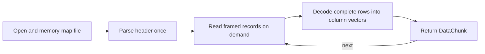

# Streaming API

## Overview

The streaming API reads HSPICE binary records incrementally and returns
column-oriented chunks without constructing a complete `WaveformResult`.
It supports 9601 (`f32`) and 2001 (`f64`) files, real and AC complex data, and
both little- and big-endian input.

SPICE3 raw files are not supported by this API; use `read_raw()` for those.

## How It Works



`HspiceStreamReader` keeps the mapped input, the current byte position, parsed
header metadata, an incremental `DataTableBuilder`, and any partial row that
crosses a record boundary. Record payloads are decoded directly into the final
column vectors.

`chunk_size` is a minimum target, not a strict maximum. The reader consumes
whole HSPICE records until it has at least that many points, so a returned chunk
can be larger. Values smaller than 1 are normalized to 1.

## Rust API

```rust
use hspice_core::{read_stream_signals, VectorData};

fn main() -> hspice_core::Result<()> {
    let mut reader = read_stream_signals(
        "large.tr0",
        &["v(out", "i(vdd"],
        50_000,
    )?;

    let metadata = reader.metadata();
    println!("{}: {}", metadata.title, metadata.scale_name);

    for chunk in reader.by_ref() {
        let chunk = chunk?;
        let point_count = chunk
            .data
            .get(&metadata.scale_name)
            .map_or(0, VectorData::len);
        println!(
            "chunk {}: {} points, {:?}",
            chunk.chunk_index, point_count, chunk.time_range
        );
    }

    reader.reset();
    Ok(())
}
```

The public constructors are:

| Function | Behavior |
| -------- | -------- |
| `read_stream(path)` | Uses `DEFAULT_CHUNK_SIZE` (10,000 points) |
| `read_stream_chunked(path, chunk_size)` | Sets a custom minimum chunk size |
| `read_stream_signals(path, signals, chunk_size)` | Also filters returned signal vectors |
| `HspiceStreamReader::open(path, chunk_size)` | Direct constructor |

`metadata()` returns `StreamMetadata` with the title, date, scale name, signal
names, POST version, and complex-data flag. `reset()` restarts at the first data
record without reparsing the header.

### `DataChunk`

```rust
pub struct DataChunk {
    pub chunk_index: usize,
    pub time_range: (f64, f64),
    pub data: HashMap<String, VectorData>,
}
```

Despite the historical field name `time_range`, the pair contains the first
and last values of the scale vector. For AC and DC files, those values are a
frequency or sweep range rather than time.

The scale vector is always present in `data`. A signal filter applies only to
dependent signals; it reduces returned data but all source columns still have
to be decoded.

## Python API

The native extension raises `RuntimeError` if the file cannot be opened or its
header is invalid:

```python
from hspicetr0parser import stream

for chunk in stream("large.tr0", chunk_size=50_000, signals=["v(out"]):
    print(chunk["chunk_index"], chunk["time_range"])
    scale = chunk["data"]["TIME"]
    vout = chunk["data"]["v(out"]
```

The compatibility wrapper keeps its legacy generator behavior and turns an
open/parse failure into an empty iterator:

```python
from hspice_tr0_parser import stream

assert list(stream("missing.tr0")) == []
```

Each Python chunk is a dictionary with `chunk_index`, `time_range`, and a
`data` dictionary containing NumPy arrays. Real vectors use `float64`; complex
vectors use `complex128`.

## C API

```c
CWaveformStream *stream = waveform_stream_open("large.tr0", 50000, 0);
if (stream == NULL) {
    /* open or header parse failed */
}

while (stream != NULL && waveform_stream_next(stream) == 1) {
    int count = waveform_stream_get_chunk_size(stream);
    double *values = malloc((size_t)count * sizeof(double));
    int copied = waveform_stream_get_signal_data(
        stream, "v(out", values, count
    );
    /* Process values[0..copied]. */
    free(values);
}

waveform_stream_close(stream);
```

`waveform_stream_next()` returns `1` for a chunk, `0` at end of input, and `-1`
on a decode error. The C streaming signal accessor returns complex vectors as
magnitudes; use the full-read `waveform_get_complex_data()` API when separate
real and imaginary components are required.

## Boundaries and Limitations

- Peak decoded-data memory scales with the current chunk and number of source
  columns rather than the total file size. The OS can page the read-only memory
  map as needed.
- Rows that cross record boundaries are preserved in an internal partial-row
  buffer.
- The current iterator stops at the first HSPICE end marker. For a parameter
  sweep containing multiple data tables, use `read()` to retrieve every table.
- A malformed trailing partial row is ignored after trace-level diagnostics.

## Verification

The Rust and Python suites compare streamed point counts, ranges, and values
against full reads and exercise 9601 transient, 2001 transient, 9601 AC, and
9601 DC fixtures. See [HOWTOTEST.md](HOWTOTEST.md) for current commands.
